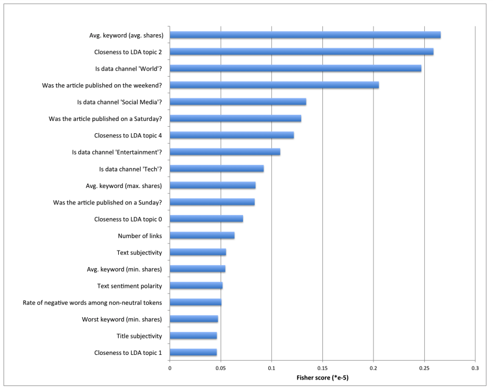
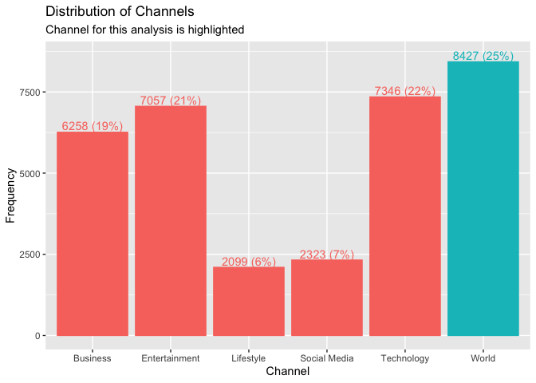
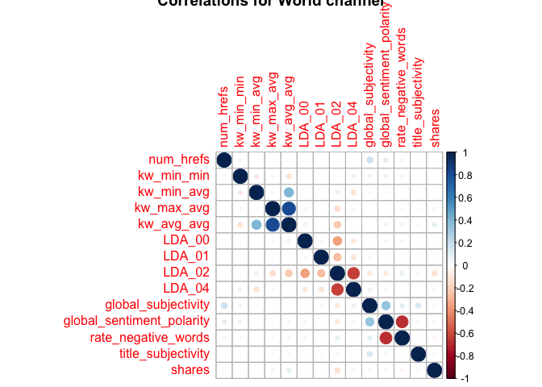
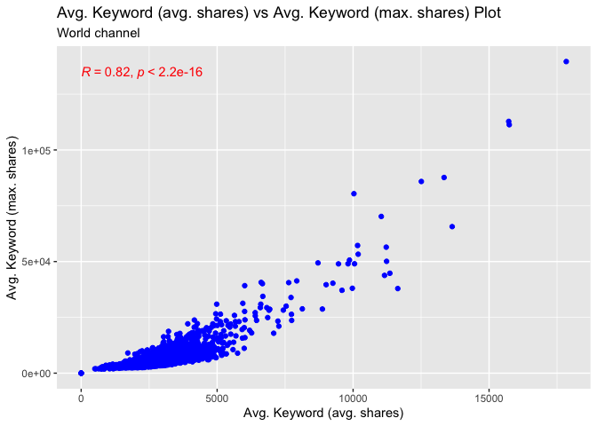
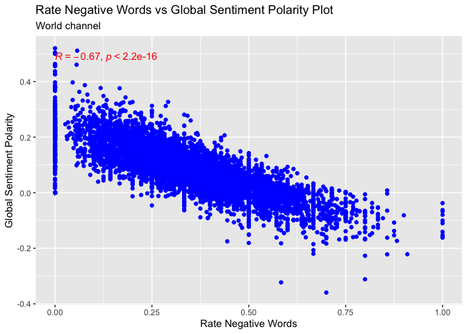
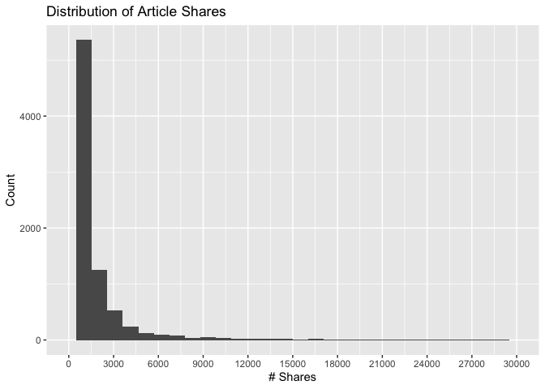
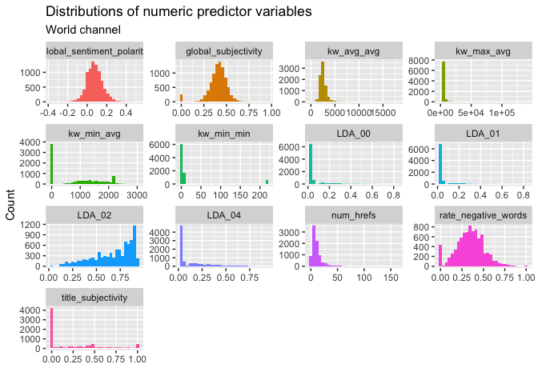
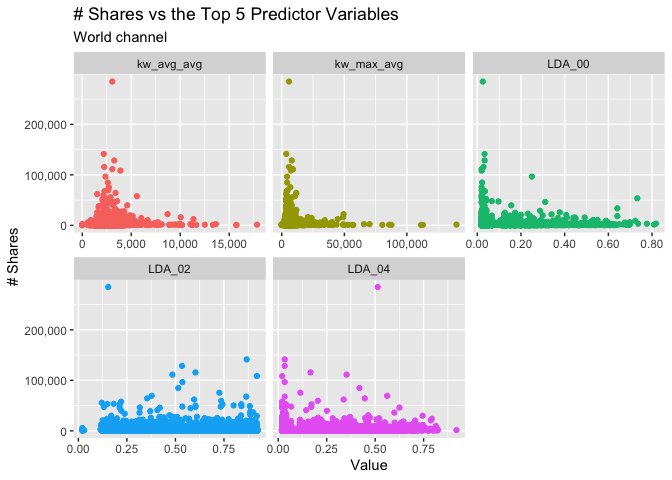
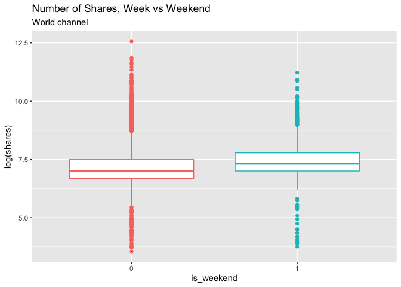

ST558 Project 2
================
Daniel Dulaney & Jeremias Endrina
October 31, 2021

-   [Introduction](#introduction)
-   [Data](#data)
-   [Summarizations](#summarizations)
-   [Modeling](#modeling)
-   [Comparison](#comparison)

# Introduction

Before starting, we’ll read in the libraries used in this analysis and
create a few new variables based on the R Markdown channel parameter.

``` r
# set seed for reproducibility
set.seed(558)

# load necessary libraries
library(rmarkdown)
library(tidyverse)
library(caret)
library(knitr)
library(corrplot)
library(here)
library(kableExtra)
library(scales)
library(ggpubr)
library(ggeasy)
library(gbm)
```

``` r
# create a "data_channel_is_*" variable based on the channel specified as the
# parameter -- this allows us to refer to the column name while also having
# the simpler channel name with params$chan
chanCol <- as.name(paste0("data_channel_is_", params$chan))

# also create a version of the channel that is capitalized for easy labelling on 
# tables and plots (chans by default are lowercase, e.g. 'lifestyle')
if (params$chan %in% c("lifestyle", "entertainment", "world")) {
  chanTitle <- params$chan %>% str_to_title()
} else if (params$chan == "bus") {
  chanTitle <- "Business"
} else if (params$chan == "socmed") {
  chanTitle <- "Social Media"
} else if (params$chan == "tech") {
  chanTitle <- "Technology"
}
```

## Online News Popularity Data Set

With the unending developments of the internet, more and more people
have access to online news articles. And when people enjoy articles they
read, they tend to share them through their social media accounts. Thus,
the popularity of news articles can be associated to the number of times
they are shared. In this project, we intend to find the best model that
predicts the popularity of the online news from 6 different channels
using various techniques we learned in class: linear regression, random
forest and boosted tree models.

The online news popularity data set that we will use is taken from the
UCI Machine Learning Repository. The data comes from a popular online
news [Mashable]('www.mashable.com'). There are 39644 articles, 58
predictive attributes, 2 non-predictive and 1 goal field in the data
set.

In this analysis, the channel being focused on is World.

## Descriptions of Variables

As mentioned, there are 58 predictors and 1 response variables in the
data set. With this, we need to select the most important predictor
variables to reduce noise in the model. Ren and Young (2015) from
Stanford University in their
[report]('http://cs229.stanford.edu/proj2015/328_report.pdf') used
different ways to reduce such variables. They used Fisher criterion to
determine the top 20 predictors. The Fisher score for the

feature is given by:

 =  \frac{(\bar{x}^1_j - \bar{x}^2_j)^2}{(s^1_j)^2 + (s^2_j)^2},")

  
where  

^2 = \sum_{x \in X^k}(x_j - \bar{x}^k_j)^2")

  
In this project, we are adapting their method and using the top 20
variables that they found more discriminative, see figure below.

<!-- -->

Since we are reporting by type of channel, we can only use 16 predictor
variables for channel variables in general will become irrelevant. Below
is the list of variables that we will use and their corresponding
descriptions.

1.  `kw_avg_avg`: Avg. keyword (avg. shares)  
2.  `LDA_02`: Closeness to LDA topic 2  
3.  `is_weekend`: Was the article published on the weekend?  
4.  `weekday_is_saturday`: Was the article published on a Saturday?  
5.  `LDA_04`: Closeness to LDA topic 4  
6.  `kw_max_avg`: Avg. keyword (max. shares)  
7.  `weekday_is_sunday`: Was the article published on a Sunday?  
8.  `LDA_00`: Closeness to LDA topic 0  
9.  `num_hrefs`: Number of links  
10. `global_subjectivity`: Text subjectivity  
11. `kw_min_avg`: Avg. keyword (min. shares)  
12. `global_sentiment_polarity`: Text sentiment polarity  
13. `rate_negative_words`: Rate of negative words among non-neutral
    tokens  
14. `kw_min_min`: Worst keyword (min. shares)  
15. `title_subjectivity`: Title subjectivity  
16. `LDA_01`: Closeness to LDA topic 1

The response variable that we will try to predict using predictive
models will be: 17. shares: Number of shares

## Purpose and Methods

In this project, we aim to find the best model among two linear
regressions, a random forest, and a boosted tree model. Cross-validation
will be used in choosing the best model with the optimal tuning
parameters. Lastly, all four models will be compared on the test set
based on their root mean square error (RMSE).

# Data

## Reading in

``` r
# read in data set (a raw version straight from Moodle, and one we will be 
# manipulating)
dataRaw <- read_csv(here('OnlineNewsPopularity.csv'))

data <- read_csv(here('OnlineNewsPopularity.csv')) %>% 
  dplyr::select(-c(url,timedelta))

# subset dataset to only include the one channel currently being used
chanData <- data %>% 
  filter((!!sym(chanCol)) == 1)
```

## Filtering and Splitting

``` r
# set seed and select variables to use
set.seed(2)
variables <- c(6,18,24:26,35:39,40,42:44,48,55,59)
chanData <- chanData[, variables]

# set weekday_is_saturday, weekday_is_sunday and is_weekend as factors
chanData$weekday_is_saturday <- as.factor(paste0('class', chanData$weekday_is_saturday))
chanData$weekday_is_sunday <- as.factor(paste0('class', chanData$weekday_is_sunday))
chanData$is_weekend <- as.factor(paste0('class', chanData$is_weekend))

# split data set
index <- createDataPartition(chanData$shares, p=0.7, list=F)

train <- chanData[index, ]
test <- chanData[-index, ]
```

# Summarizations

First, we look at the number of different channels in the overall data
set. The highlighted bar is the channel we’re focusing on in this
analysis.

``` r
#generate data frame of channels and its frequency
channels <- data[, c(12:17)]
counts <- data.frame(Channel = c("Lifestyle", "Entertainment", "Business",
                                 "Social Media", "Technology", "World"), 
                     Frequency = colSums(channels)) %>% 
  mutate(pct = Frequency / sum(Frequency),
         pct = percent_format(accuracy = 1)(pct),
         # so can color channel being analyzed in this report
         is_being_analyzed = ifelse(Channel == chanTitle, "1", "0"))

#generate a contingency table
rownames(counts) <- NULL

# generate a plot showing counts for, highlighting channel for this analysis
counts %>% 
  ggplot(aes(x = Channel, y = Frequency, fill = is_being_analyzed, 
             color = is_being_analyzed)) +
  geom_col() + 
  geom_text(aes(label = str_c(Frequency, " (", pct, ")")), nudge_y = 200) +
  easy_remove_legend() +
  labs(title = "Distribution of Channels",
       subtitle = "Channel for this analysis is highlighted")
```

<!-- -->

We can see from the bar plot that the World Channel has the highest
number of articles while Lifestyle Channel has the lowest number of
articles in this data set.

*From this point on, the data will be subsetted to only include the
channel for this analysis (i.e. Lifestyle, Business, etc).*

Below are the 5-number summaries of the continuous predictors with the
top 5 highest Fisher scores, as well as the response variable `shares`.

``` r
topVars <- c(5, 4, 9, 11, 12, 17)
topVarsName <- c("kw_avg_avg", "kw_max_avg", "LDA_00", "LDA_02", "LDA_04", "shares")

do.call(cbind, lapply(train[, topVars], summary)) %>% 
  kable(digits = c(0, 0, 2, 2, 0), caption = str_c("5-Number Summaries for ", 
                                                   chanTitle, 
                                                   " channel")) %>% 
  kable_styling(full_width = FALSE)
```

<table class="table" style="width: auto !important; margin-left: auto; margin-right: auto;">
<caption>
5-Number Summaries for World channel
</caption>
<thead>
<tr>
<th style="text-align:left;">
</th>
<th style="text-align:right;">
kw_avg_avg
</th>
<th style="text-align:right;">
kw_max_avg
</th>
<th style="text-align:right;">
LDA_00
</th>
<th style="text-align:right;">
LDA_02
</th>
<th style="text-align:right;">
LDA_04
</th>
<th style="text-align:right;">
shares
</th>
</tr>
</thead>
<tbody>
<tr>
<td style="text-align:left;">
Min.
</td>
<td style="text-align:right;">
0
</td>
<td style="text-align:right;">
0
</td>
<td style="text-align:right;">
0.02
</td>
<td style="text-align:right;">
0.02
</td>
<td style="text-align:right;">
0
</td>
<td style="text-align:right;">
35
</td>
</tr>
<tr>
<td style="text-align:left;">
1st Qu.
</td>
<td style="text-align:right;">
2072
</td>
<td style="text-align:right;">
3457
</td>
<td style="text-align:right;">
0.03
</td>
<td style="text-align:right;">
0.53
</td>
<td style="text-align:right;">
0
</td>
<td style="text-align:right;">
827
</td>
</tr>
<tr>
<td style="text-align:left;">
Median
</td>
<td style="text-align:right;">
2403
</td>
<td style="text-align:right;">
3588
</td>
<td style="text-align:right;">
0.03
</td>
<td style="text-align:right;">
0.73
</td>
<td style="text-align:right;">
0
</td>
<td style="text-align:right;">
1100
</td>
</tr>
<tr>
<td style="text-align:left;">
Mean
</td>
<td style="text-align:right;">
2525
</td>
<td style="text-align:right;">
4728
</td>
<td style="text-align:right;">
0.07
</td>
<td style="text-align:right;">
0.67
</td>
<td style="text-align:right;">
0
</td>
<td style="text-align:right;">
2164
</td>
</tr>
<tr>
<td style="text-align:left;">
3rd Qu.
</td>
<td style="text-align:right;">
2784
</td>
<td style="text-align:right;">
4712
</td>
<td style="text-align:right;">
0.04
</td>
<td style="text-align:right;">
0.84
</td>
<td style="text-align:right;">
0
</td>
<td style="text-align:right;">
1900
</td>
</tr>
<tr>
<td style="text-align:left;">
Max.
</td>
<td style="text-align:right;">
17839
</td>
<td style="text-align:right;">
139600
</td>
<td style="text-align:right;">
0.81
</td>
<td style="text-align:right;">
0.92
</td>
<td style="text-align:right;">
1
</td>
<td style="text-align:right;">
115700
</td>
</tr>
</tbody>
</table>

We can then explore which variables are correlated to each other using
the `corrplot` function. Categorical variables are not included in here.

``` r
correlation <- cor(train[, -c(6:8)])

correlation %>% 
  corrplot(title = str_c("Correlations for ", chanTitle, " channel"))
```

<!-- -->

Looking at the plot above, the size and color of the circle indicate how
strong the correlation between two variables are. The darker the blue
is, the more positively correlated they are. While the darker the red
is, the more negatively correlated the variables will be.

Next are scatterplots of some of the pairs of variables such as
`kw_avg_avg: Avg. keyword (avg. shares)` &
`kw_max_avg: Avg. keyword (max. shares)` and
`rate_negative_words: Rate of negative words among non-neutral tokens` &
`global_sentiment_polarity: Text sentiment polarity`. These plots
include all 6 channel categories.

``` r
# scatterplot of `kw_avg_avg` & `kw_max_avg``
chanData %>% 
  ggplot(aes(kw_avg_avg, kw_max_avg)) +
  geom_point(color="blue") +
  stat_cor(color = "red") +
  labs(title="Avg. Keyword (avg. shares) vs Avg. Keyword (max. shares) Plot",
       subtitle = str_c(chanTitle, " channel"),
       x = "Avg. Keyword (avg. shares)", y="Avg. Keyword (max. shares)")
```

<!-- -->

``` r
# scatterplot of `rate_negative_words` & `global_sentiment_polarity`
chanData %>% 
  ggplot(aes(rate_negative_words, global_sentiment_polarity)) +
  geom_point(color="blue") +
  stat_cor(color = "red") +
  labs(title="Rate Negative Words vs Global Sentiment Polarity Plot",
       subtitle = str_c(chanTitle, " channel"),
       x="Rate Negative Words", y="Global Sentiment Polarity") 
```

<!-- -->

So we learn here that there are a few articles that get shared a ton
(hundreds of thousands of times), but that lots of articles don’t get
shared at all. Now, we’ll take a took at articles that get shared the
most, along with a zoomed-in look at the distribution near 0.

``` r
chanData %>% 
  arrange(desc(shares)) %>% 
  select(shares) %>% 
  mutate(rank = row_number(), .before = shares,
         shares = comma_format(accuracy = 1)(shares)) %>% 
  slice(1:20) %>% 
  kable(caption = str_c("Articles with the most shares, ", chanTitle, " channel")) %>% 
  kable_styling(full_width = FALSE)
```

<table class="table" style="width: auto !important; margin-left: auto; margin-right: auto;">
<caption>
Articles with the most shares, World channel
</caption>
<thead>
<tr>
<th style="text-align:right;">
rank
</th>
<th style="text-align:left;">
shares
</th>
</tr>
</thead>
<tbody>
<tr>
<td style="text-align:right;">
1
</td>
<td style="text-align:left;">
284,700
</td>
</tr>
<tr>
<td style="text-align:right;">
2
</td>
<td style="text-align:left;">
141,400
</td>
</tr>
<tr>
<td style="text-align:right;">
3
</td>
<td style="text-align:left;">
128,500
</td>
</tr>
<tr>
<td style="text-align:right;">
4
</td>
<td style="text-align:left;">
115,700
</td>
</tr>
<tr>
<td style="text-align:right;">
5
</td>
<td style="text-align:left;">
111,300
</td>
</tr>
<tr>
<td style="text-align:right;">
6
</td>
<td style="text-align:left;">
108,400
</td>
</tr>
<tr>
<td style="text-align:right;">
7
</td>
<td style="text-align:left;">
96,500
</td>
</tr>
<tr>
<td style="text-align:right;">
8
</td>
<td style="text-align:left;">
84,800
</td>
</tr>
<tr>
<td style="text-align:right;">
9
</td>
<td style="text-align:left;">
75,500
</td>
</tr>
<tr>
<td style="text-align:right;">
10
</td>
<td style="text-align:left;">
69,300
</td>
</tr>
<tr>
<td style="text-align:right;">
11
</td>
<td style="text-align:left;">
67,700
</td>
</tr>
<tr>
<td style="text-align:right;">
12
</td>
<td style="text-align:left;">
64,300
</td>
</tr>
<tr>
<td style="text-align:right;">
13
</td>
<td style="text-align:left;">
62,000
</td>
</tr>
<tr>
<td style="text-align:right;">
14
</td>
<td style="text-align:left;">
59,400
</td>
</tr>
<tr>
<td style="text-align:right;">
15
</td>
<td style="text-align:left;">
57,800
</td>
</tr>
<tr>
<td style="text-align:right;">
16
</td>
<td style="text-align:left;">
55,600
</td>
</tr>
<tr>
<td style="text-align:right;">
17
</td>
<td style="text-align:left;">
53,500
</td>
</tr>
<tr>
<td style="text-align:right;">
18
</td>
<td style="text-align:left;">
53,100
</td>
</tr>
<tr>
<td style="text-align:right;">
19
</td>
<td style="text-align:left;">
52,700
</td>
</tr>
<tr>
<td style="text-align:right;">
20
</td>
<td style="text-align:left;">
52,600
</td>
</tr>
</tbody>
</table>

``` r
chanData %>% 
  ggplot(aes(shares)) +
  geom_histogram(bins = 30) +
  scale_x_continuous(breaks = seq(0, 30000, 3000), limits = c(0, 30000)) +
  labs(title = "Distribution of Article Shares",
       x = "# Shares", y = "Count")
```

<!-- -->

A few articles got shared 100,000+ times, but we see the list quickly
drop off. It’s a very skewed distribution, which could make it tricky to
model – with so many articles having a similarly low share count, it
could be tough to differentiate between them and predict `shares` well.

Next, we look closer at the numeric predictor variables and their
relationship with `shares` – first, distributions of the inputs, and
then scatterplots with each input vs `shares`.

``` r
# distributions of all numeric inputs
chanData %>% 
  select_if(is.numeric) %>%
  select(-shares) %>% 
  pivot_longer(cols = num_hrefs:title_subjectivity,
               names_to = "var",
               values_to = "value") %>% 
  ggplot(aes(value, fill = var)) +
  geom_histogram() +
  facet_wrap(~var, scales = "free") +
  easy_remove_legend() +
  labs(title = "Distributions of numeric predictor variables",
       subtitle = str_c(chanTitle, " channel"),
       x = "", y = "Count")
```

<!-- -->

``` r
# scatterplot of shares vs each 5 variables
chanData %>% 
  select_if(is.numeric) %>%
  pivot_longer(cols = num_hrefs:title_subjectivity,
               names_to = "var",
               values_to = "value") %>% 
  filter(var %in% topVarsName) %>% 
  ggplot(aes(value, shares, color = var)) +
  geom_point() +
  facet_wrap(~var, scales = "free_x") +
  scale_x_continuous(labels = comma_format()) +
  scale_y_continuous(labels = comma_format()) +
  easy_remove_legend() +
  labs(title = "# Shares vs the Top 5 Predictor Variables",
       subtitle = str_c(chanTitle, " channel"),
       x = "Value", y = "# Shares")
```

<!-- -->

And finally, we take a look at `shares` on weekdays vs weekends. Since
there are a few very large positive outliers, we take the log of
`shares`.

``` r
# boxplot of shares on different weekdays
chanData %>%
  mutate(is_weekend = str_remove_all(is_weekend, "class")) %>% 
  ggplot(aes(is_weekend, log(shares), color = is_weekend)) +
  geom_boxplot() +
  easy_remove_legend() +
  labs(title = "Number of Shares, Week vs Weekend",
       subtitle = str_c(chanTitle, " channel"))
```

<!-- -->

# Modeling

## Linear Regression

The first models we’ll fit to predict the number of shares for the World
channel are multiple linear regression models (MLR). MLR is used to
model the linear relationship between a set of explanatory variables (in
our example, the 16 outlined in the introduction) and a response
variable (`shares`). Because the statistical model behind linear
regression is explicitly defined (unlike many more “black-box” machine
learning methods), we can learn a lot about the inputs, like their
relative significances and coefficient confidence intervals.

There are a few key assumptions to linear regression models that limit
their flexibility, but again allow us to learn quite a bit about the
exact relationships between predictors and response. These include:

-   Predictors and response are linearly related
-   No or little collinearity between predictors
-   Normal errors, centered at 0 with constant variance

### Without Backwards Selection

First, we’ll run a multiple linear regression model without any kind of
variable selection – the 16 variables defined as important at the
beginning will all be used as inputs in the final model.

``` r
# for reproducibility
set.seed(10)

# fit model
fitMLR <- train(shares ~ ., 
                data = train,
                method = "lm",
                trControl = trainControl(method = "cv", number = 5))

#calculate RMSE
predMLR <- predict(fitMLR, newdata = test)
rmseMLR <- round(postResample(pred = predMLR, obs = test$shares), 3)[1]
```

### Using Backwards Selection

Then, we can automate the process of selecting important variables that
would generate the lowest RMSE using backwards selection and repeated
cross validation of the `{caret}`.

``` r
# set seed for reproducibility
set.seed(10)

# set options for type of modeling and cross validation
ctrl <- rfeControl(functions = lmFuncs, 
                   method = "repeatedcv", 
                   repeats = 5, 
                   verbose = FALSE)

fitBWSel <- rfe(shares ~ ., 
                preProc = c("center", "scale"), 
                sizes = c(1:17),
                rfeControl = ctrl, 
                data=train)

# calculate RMSE
predBWSel <- predict(fitBWSel, newdata = test)
rmseBWSel <- round(sqrt(mean((predBWSel-test$shares)^2)), 3)
```

## Random Forest Model

We can also fit an ensemble tree-based random forest in our training
data in order to try and predict the number of shares of a particular
article. A random forest is a supervised learning algorithm that makes
use of an ensemble method to solve regression or classification
problems. In this project, we are dealing with a regression problem. The
method works by creating a large number of decision trees on training
and spitting out the mean of prediction of the individual trees. We will
use the `caret` package in R to do all the process of
[adaptive]('https://topepo.github.io/caret/adaptive-resampling.html')
cross-validation and tuning for us.

``` r
# for reproducibility
set.seed(10)

##set options for type of modeling and cross validation
ctrl <- trainControl(method= "adaptive_cv", 
                     classProbs = T, 
                     verboseIter = T, 
                     adaptive = list(min = 5, alpha = 0.05, method = "gls", complete=T))

fitRF <- train(shares ~ ., 
               data = train, 
               method = "rf", 
               preProc = c("center", "scale"), 
               trControl = ctrl)

#calculate RMSE
predRF <- predict(fitRF, newdata = test)
rmseRF <- round(postResample(pred = predRF, obs = test$shares), 3)[1]
```

## Boosted Tree Model

Lastly, we’ll fit a boosted tree model. Like a random forest, this is a
tree-based model – it differs, however, in that trees are grown
sequentially, using information about the previous tree’s performance to
update the new one. This method is more computationally expensive than a
random forest, but can often lead to better predictions. Unlike linear
regression, the results from a boosted tree model are not very
interpretable (though predictions are often strong).

``` r
# for reproducibility
set.seed(10)

# fit model, get rmse
fitBT <- train(shares ~ .,
               data = train,
               method = "gbm",
               trControl = trainControl(method = "cv", number = 5))

predBT <- predict(fitBT, newdata = test)
rmseBT <- round(postResample(pred = predBT, obs = test$shares), 3)[1]
```

# Comparison

Now that we have created four models that try to predict the number of
shares for a particular news article, we can then compare how each of
these models perform with our test set in terms of their RMSE.

<table class="table" style="width: auto !important; margin-left: auto; margin-right: auto;">
<caption>
Comparison of Models’ RMSE, World channel
</caption>
<thead>
<tr>
<th style="text-align:left;">
Model
</th>
<th style="text-align:right;">
RMSE
</th>
</tr>
</thead>
<tbody>
<tr>
<td style="text-align:left;">
Random Forest
</td>
<td style="text-align:right;">
8758.916
</td>
</tr>
<tr>
<td style="text-align:left;">
MLR
</td>
<td style="text-align:right;">
8765.216
</td>
</tr>
<tr>
<td style="text-align:left;">
MLR w/ Backwards Selection
</td>
<td style="text-align:right;">
8765.216
</td>
</tr>
<tr>
<td style="text-align:left;">
Boosted Tree
</td>
<td style="text-align:right;">
8770.462
</td>
</tr>
</tbody>
</table>

After evaluating prediction performance of each model to the test set,
the model with the lowest root mean square error (RMSE) can be declared
the winning model for World channel. That is, this model fits the data
well enough to predict the number of `shares` of a given World news
article.
