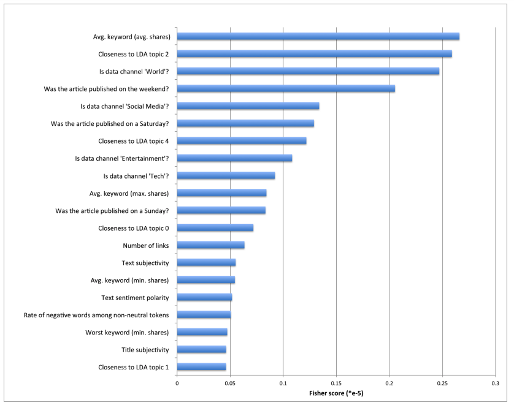

```{r setup, include=FALSE, message=FALSE, echo=FALSE}
# set seed for reproducibility
set.seed(558)

# load necessary libraries
library(rmarkdown)
library(tidyverse)
library(caret)
library(knitr)
library(corrplot)
library(leaps)
library(here)
library(kableExtra)
library(scales)
library(ggpubr)
library(ggeasy)
```  

# Introduction  

## Online News Popularity Data Set  

With the unending developments of the internet, more and more people have access to online news articles. And when people enjoy articles they read, they tend to share them through their social media accounts. Thus, the popularity of news articles can be associated to the number of times they are shared. In this project, we intend to find the best model that predicts the popularity of the online news from 6 different channels using various techniques we learned in class.  

The online news popularity data set that we will use is taken from the UCI Machine Learning Repository. The data comes from a popular online news [Mashable]('www.mashable.com'). There are 39644 articles, 58 predictive attributes, 2 non-predictive and 1 goal field in the data set.


## Descriptions of Variables  

As mentioned, there are 58 predictors and 1 response variables in the data set. With this, we need to select the most important predictor variables to reduce noise in the model. Ren and Young (2015) from Stanford University in their [report]('http://cs229.stanford.edu/proj2015/328_report.pdf') used different ways to reduce such variables. They used Fisher criterion to determine the top 20 predictors. The Fisher score for the $j^{\text{th}}$ feature is given by:  

$$F(j) =  \frac{(\bar{x}^1_j - \bar{x}^2_j)^2}{(s^1_j)^2 + (s^2_j)^2},$$  
where  
$$(s^k_j)^2 = \sum_{x \in X^k}(x_j - \bar{x}^k_j)^2$$  
In this project, we are adapting their method and using the top 20 variables that they found more discriminative, see figure below.  

```{r fscores, echo=FALSE}

```   


Since we are reporting by type of channel, we can only use 16 perdictor variables for channel variables in general will become irrelevant. Below is the list of variables that we will use and their corresponding descriptions.  

1. `kw_avg_avg`: Avg. keyword (avg. shares)  
2. `LDA_02`: Closeness to LDA topic 2  
3. `is_weekend`: Was the article published on the weekend?  
4. `weekday_is_saturday`: Was the article published on a Saturday?  
5. `LDA_04`: Closeness to LDA topic 4  
6. `kw_max_avg`: Avg. keyword (max. shares)  
7. `weekday_is_sunday`: Was the article published on a Sunday?  
8. `LDA_00`: Closeness to LDA topic 0  
9. `num_hrefs`: Number of links  
10. `global_subjectivity`: Text subjectivity  
11. `kw_min_avg`: Avg. keyword (min. shares)  
12. `global_sentiment_polarity`: Text sentiment polarity  
13. `rate_negative_words`: Rate of negative words among non-neutral tokens  
14. `kw_min_min`: Worst keyword (min. shares)  
15. `title_subjectivity`: Title subjectivity  
16. `LDA_01`: Closeness to LDA topic 1  

The response variable that we will try to predict using predictive models will be:
17. shares: Number of shares


## Purpose and Methods  

In this project, we aim to find the best model among two linear regressions, random forest and  boosted tree models. Cross validation will be used in choosing the best model with the optimal tuning parameters. Lastly, all four models will be compared on the test set based on misclassification and accuracy rates.  


# Data  

## Reading in the Data  

```{r warning=FALSE, message=FALSE}
# read in data set (a raw version straight from Moodle, and one we will be 
# manipulating)
dataRaw <- read_csv(here('OnlineNewsPopularity.csv'))

data <- read_csv(here('OnlineNewsPopularity.csv')) %>% 
  dplyr::select(-c(url,timedelta))

# subset data set by channel (in this case channel=entertainment)
# when we change the channel parameter, this data set will also change
chanVar <- as.name(paste0("data_channel_is_", params$channel))

chanData <- data %>% 
  filter((!!sym(chanVar)) == 1)
```


## Filtering and Splitting Data

```{r}
#set seed and variables to use
set.seed(2)
variables <- c(6,18,24:26,35:39,40,42:44,48,55,59)
chanData <- chanData[,variables]

#set weekday_is_saturday, weekday_is_sunday and is_weekend as factors
chanData$weekday_is_saturday <- as.factor(paste0('class', chanData$weekday_is_saturday))
chanData$weekday_is_sunday <- as.factor(paste0('class', chanData$weekday_is_sunday))
chanData$is_weekend <- as.factor(paste0('class', chanData$is_weekend))

#split data set
index <- createDataPartition(chanData$shares, p=0.7, list=F)

train <- chanData[index, ]
test <- chanData[-index, ]
```


# Summarizations  

## Number of Channels

In this portion, we will look at the number of different channels in the data set.

```{r}
#generate data frame of channels and its frequency
channels <- data[, c(12:17)]
counts <- data.frame(Channel = c("Lifestyle", "Entertainment", "Business",
                                 "Social Media", "Technology", "World"), 
                     Frequency = colSums(channels))

#generate a contingency table
rownames(counts) <- NULL

counts %>%
  mutate(pct = Frequency / sum(Frequency),
         pct = percent_format(accuracy = 1)(pct)) %>% 
  arrange(desc(Frequency)) %>% 
  kable(digits = 0) %>% 
  kable_styling(full_width = FALSE)

#generate a plot 
counts %>% 
  ggplot(counts, aes(x = Channel, y = Frequency)) +
  geom_col(fill="light blue") + 
  geom_text(aes(label = Frequency), nudge_y = 200) +
  labs(title = "Distribution of Channels")
```

We can see from both contingency table and bar plot that the World Channel has the highest number of articles while Lifestyle Channel has the lowest number of articles in this data set.  

## Numeric Summaries

We will only look at the five number summaries of the continuous predictors with the top 5 highest Fisher scores. We will also include the response variable `shares`.

```{r}
topVars <- c(5, 11, 12, 4, 9, 17)
topVarsName <- c("kw_avg_avg", "LDA_02", "LDA_04", "kw_max_avg", "LDA_00", "shares")

train[, topVars] %>% 
  summary() %>% 
  as_tibble()
  kable(digits = 2) %>% 
  kable_styling(full_width = FALSE)

kable(summary(train[,topVars]))
```

These summaries show measures of center (mean and median) and measures of spread (quantiles, min and max) for each variable.


## Plots

We can explore which variables are correlated to each other using the corrplot function. Categorical variables are not included in here.

```{r}
correlation <- cor(train[, -c(6:8)])
correlation %>% corrplot()
```

Looking at the plot above, the size and color of the circle indicate how strong the correlation between two variables are. The darker the blue is, the more positively correlated they are. While the darker the red is, the more negatively correlated the variables will be.

We can show scatterplots of some of the pairs of variables such as `kw_avg_avg: Avg. keyword (avg. shares)` & `kw_max_avg: Avg. keyword (max. shares)` and  `rate_negative_words: Rate of negative words among non-neutral tokens` & `global_sentiment_polarity: Text sentiment polarity`. These plots include all 6 channel categories. 

```{r}
# scatterplot of `kw_avg_avg` & `kw_max_avg``
train %>% 
  ggplot(aes(kw_avg_avg, kw_max_avg)) +
  geom_point(color="blue") +
  stat_cor(color = "red") +
  labs(title="Avg. Keyword (avg. shares) vs Avg. Keyword (max. shares) Plot",
       x="Avg. Keyword (avg. shares)", y="Avg. Keyword (max. shares)")


# scatterplot of `rate_negative_words` & `global_sentiment_polarity`
train %>% 
  ggplot(aes(rate_negative_words, global_sentiment_polarity)) +
  geom_point(color="blue") +
  stat_cor(color = "red") +
  labs(title="Rate Negative Words vs Global Sentiment Polarity Plot",
       x="Rate Negative Words", y="Global Sentiment Polarity") 
```

To Daniel: We can add more plots especially those related to shares. Also boxplots of shares vs weekday_is_saturday, weekday_is_sunday and is_weekend for these three are categorical variables. Let me know what you think.

(DD): Agreed! Definitely need plots of explanatory variables vs shares, and
boxplots by weekday would be great. Adding some of that here

```{r}
# distribution of shares
train %>% 
  ggplot(aes(shares)) +
  geom_histogram(bins = 30) +
  labs(title = "Distribution of Article Shares",
       x = "# of Shares", y = "Count")
```

So we learn here that there are a few articles that get shared a ton (hundreds
of thousands of times), but that lots of articles don't get shared at all. Now,
we'll take a took at articles that get shared the most, along with a zoomed-in
look at the distribution near 0.

```{r}
train %>% 
  arrange(desc(shares)) %>% 
  select(shares) %>% 
  mutate(rank = row_number(), .before = shares) %>% 
  slice(1:20) %>% 
  kable() %>% 
  kable_styling(full_width = FALSE)
```

```{r}
train %>% 
  ggplot(aes(shares)) +
  geom_histogram(bins = 30) +
  scale_x_continuous(breaks = seq(0, 30000, 3000), limits = c(0, 30000)) +
  labs(title = "Distribution of Article Shares",
       x = "# Shares", y = "Count")
```

A few articles got shared 100,000+ times, but we see the list quickly drop off. 
It's a very skewed distribution, which could make it tricky to model -- with so
many articles having a similarly low share count, it could be tough to 
differentiate between them and predict `shares` well.

```{r}
# distributions of all numeric inputs
train %>% 
  select_if(is.numeric) %>%
  select(-shares) %>% 
  pivot_longer(cols = num_hrefs:title_subjectivity,
               names_to = "var",
               values_to = "value") %>% 
  ggplot(aes(value, fill = var)) +
  geom_histogram() +
  facet_wrap(~var, scales = "free") +
  easy_remove_legend() +
  labs(title = "Distributions of numeric predictor variables")
```

```{r}
# scatterplot of shares vs each 5 variables (pivot_longer and then facet_wrap)
train %>% 
  select_if(is.numeric) %>%
  pivot_longer(cols = num_hrefs:title_subjectivity,
               names_to = "var",
               values_to = "value") %>% 
  filter(var %in% topVarsName) %>% 
  ggplot(aes(value, shares, color = var)) +
  geom_point() +
  facet_wrap(~var, scales = "free_x") +
  scale_x_continuous(labels = comma_format()) +
  scale_y_continuous(labels = comma_format()) +
  easy_remove_legend() +
  labs(title = "# Shares vs the Top 5 Predictor Variables",
       x = "Value", y = "# Shares")
```

And finally, we take a look at `shares` on different days of the week.

(DD) TODO: Make a new variable that's either Sat, Sun, or Mon-Fri, and then
display boxplots of log(shares) since large positive outliers

```{r}
# boxplot of shares on different weekdays
train %>%
  mutate(day_of_week = case_when())
  mutate(is_weekend = str_remove_all(is_weekend, "class")) %>% 
  ggplot(aes(is_weekend, shares)) +
  geom_boxplot()
```


# Modeling

(DD): short introduction on linear regression...


## Linear Regression Model using Backwards Selection  
Since our goal is to create models for predicting the number of shares, then we can
automate the process of selecting important variables that would generate the
lowest RMSE using backwards selection and repeated cross validation of the `caret package`.  
```{r lmBackwardSel,include=FALSE, warning=FALSE}
#set seed for reproducibility
set.seed(10)

#set options for type of modeling and cross validation
ctrl <- rfeControl(functions = lmFuncs, method = "repeatedcv", 
                   repeats = 5, verbose = FALSE)

fitBWSel <- rfe(shares ~ ., preProc = c("center", "scale"), sizes = c(1:17),
                 rfeControl = ctrl, data=train)

#calculate RMSE
predBWSel <- predict(fitBWSel, newdata = test)
rmseBWSel <- round(sqrt(mean((predBWSel-test$shares)^2)), 3)
```


## Daniel's Linear Regression

```{r}

```


## Random Forest Model
We can also fit an ensemble tree-based random forest in our training data in order
to try and predict the number of shares of a particular article. A random forest
is a supervised learning algorithm that makes use of an ensemble method to solve
regression or classification problems. In this project, we are dealing with
a regression problem. The method works by creating a large number of decision trees on
training and spitting out the mean of prediction of the individual trees.
We will use the `caret` package in R to do all the process of [adaptive]('https://topepo.github.io/caret/adaptive-resampling.html') cross-validation
and tuning for us.  

```{r RandomForest, include=FALSE}
#set seed for reproducibility
set.seed(10)

##set options for type of modeling and cross validation
ctrl <- trainControl(method= "adaptive_cv", classProbs = T, verboseIter = T, 
                     adaptive = list(min = 5, alpha = 0.05, method = "gls", complete=T))

rfModel <- train(shares ~ ., data = train, method = "rf", preProc = c("center", "scale"), 
              trControl = ctrl)

#calculate RMSE
rfPred <- predict(rfModel, newdata = test)
rmseRF <- round(postResample(pred = rfPred, obs = test$shares), 3)
```


## Boosted Tree Model
```{r}

```


# Comparison  
Now that we have created four models that try to predict the number of shares for a particular news article, we can then compare how each of these models perform with our test set in terms of their RMSE.
```{r RMSETable, echo=FALSE}
rmseTable <- rbind.data.frame("LM Backward Sel."= rmseBWSel, 
                              "Random Forest" = rmseRF[1])
colnames(rmseTable) <- "RMSE"
rownames(rmseTable) <- c("LM Backward Sel.", "Random Forest")
kable(rmseTable, caption = "Comparison of Models' RMSE")
```  


# Automation

(DD): We can keep all the code we've written above until I finish outlining
the automation down here. I'll just write a function (or several) that take as 
input a dataset containing one type of data channel. Then, we can map through the
6 datasets, applying that function to produce written (and visual) output in
separate .Rmd files for each of the 6 datasets. 

```{r}

```


